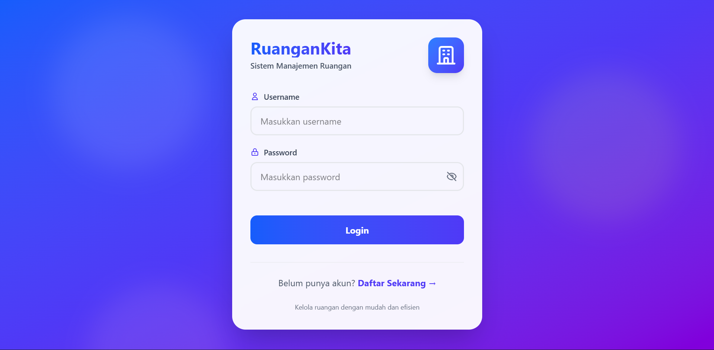
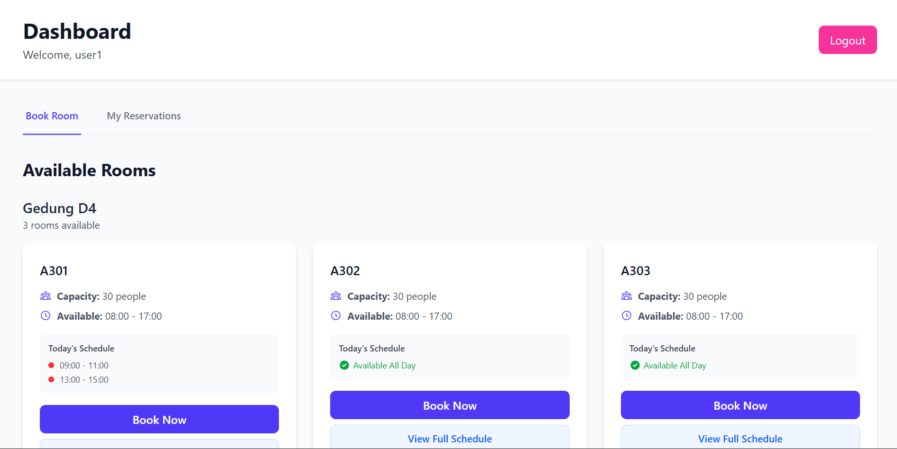
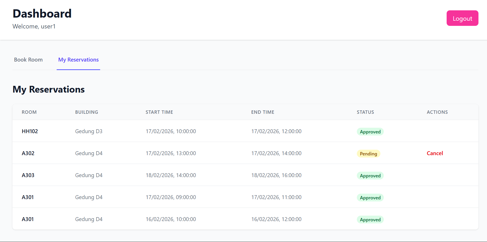
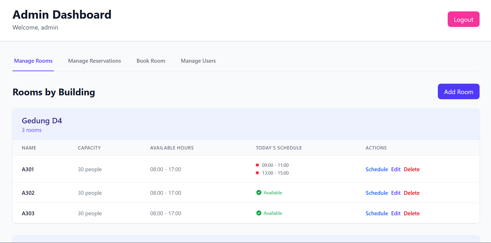
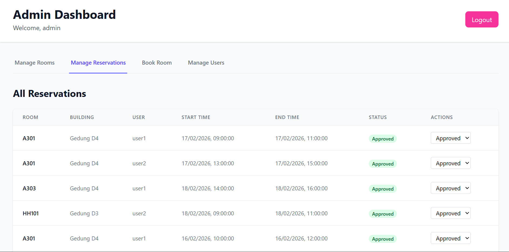
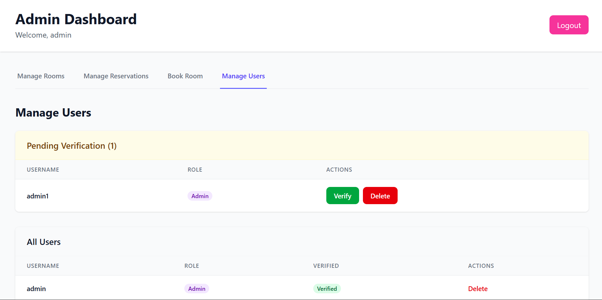

# RuanganKita - Room Reservation System

## About The Project

**RuanganKita** is a full-stack web application designed for managing and reserving rooms online. The system simplifies the room booking process for users while providing administrators with comprehensive tools to manage rooms, reservations, and user accounts.

---

## Key Features

### User Features
- **Registration & Login** - JWT-based authentication system



- **Book Room** - Reserve rooms by building, date, and time


  
- **My Reservations** - View and cancel active reservations



### Admin Features
- **Manage Rooms** - Complete CRUD operations for rooms grouped by building



- **Manage Reservations** - Approve, reject, or cancel all reservations



- **Manage Users** - Verify new users and manage user accounts



---

## Getting Started

### Prerequisites

- Docker Engine 20.10+
- Docker Compose V2

### Architecture
The application consists of three main services:

- Database: PostgreSQL
- Backend API: .NET 9.0 Web API
- Frontend: React + TypeScripts application served by Nginx

### Installation

#### 1. Clone Repository

Clone the 3 main repositories to your local machine:

```bash
git clone https://github.com/RuanganKita/2026-RuanganKita-backend
git clone https://github.com/RuanganKita/2026-RuanganKita-frontend
git clone https://github.com/RuanganKita/2026-RuanganKita-infrastructure
```

#### 2. Configure Environment Variables

Navigate to the infrastructure folder and create the `.env` file:

```bash
cd infrastructure
cp .env.example .env
```

Edit the `.env` file according to your environment requirements.

#### 3. Run Docker Compose

```bash
docker compose up
```

#### 4. Seeded Data

After running migrations, the database will be populated with initial data:

**Admin Account:**
- Username: `admin`
- Password: `admin123`

**User Account:**
- Username: `user1`
- Password: `user123`

#### 5. Access the Application

- **Frontend**: http://localhost:3000
- **Backend API**: http://localhost:8080
- **Database**: localhost:5432

#### 6. Docker Management Commands

```bash
# Stop all services
docker compose down

# Stop and remove volumes (reset database)
docker compose down -v

# Restart specific service
docker compose restart backend

# View logs of specific service
docker compose logs -f backend
```

---

#### 7. Project Structure with Docker

```
RuanganKita/
├── backend/
├── frontend/ 
├── infrastructure/
```

### Using Local Development (Without Docker)

Please refer to the corresponding backend and frontend repositories README.md file for instructions on manually building the application without containers.

---

## API Documentation

The API provides endpoints for authentication, room management, and reservation management.

### Authentication Endpoints
- `POST /auth/register` - Register a new user account
- `POST /auth/login` - Authenticate user and receive JWT token
- `POST /auth/verify/{token}` - Verify user email address

### Room Endpoints
- `GET /rooms` - Retrieve all available rooms
- `GET /rooms/{id}` - Retrieve specific room details
- `POST /rooms` - Create a new room (Admin only)
- `PUT /rooms/{id}` - Update existing room (Admin only)
- `DELETE /rooms/{id}` - Delete a room (Admin only)

### Reservation Endpoints
- `GET /reservations` - Retrieve all reservations
- `GET /reservations/{id}` - Retrieve specific reservation details
- `POST /reservations` - Create a new reservation
- `PUT /reservations/{id}` - Update your own reservation
- `DELETE /reservations/{id}` - Cancel your own reservation
- `PUT /reservations/status/{id}` - Update reservation status (Admin only)
- `GET /reservations/history` - Retrieve user's reservation history
- `GET /reservations/reserved-hours` - Get reserved time slots for a specific room and date


